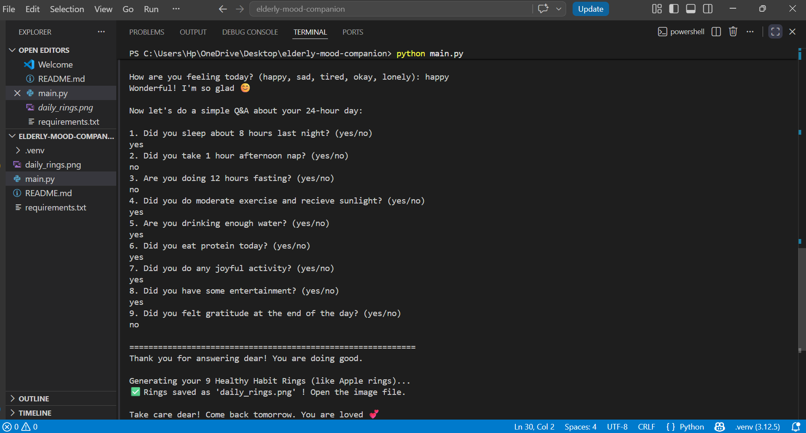
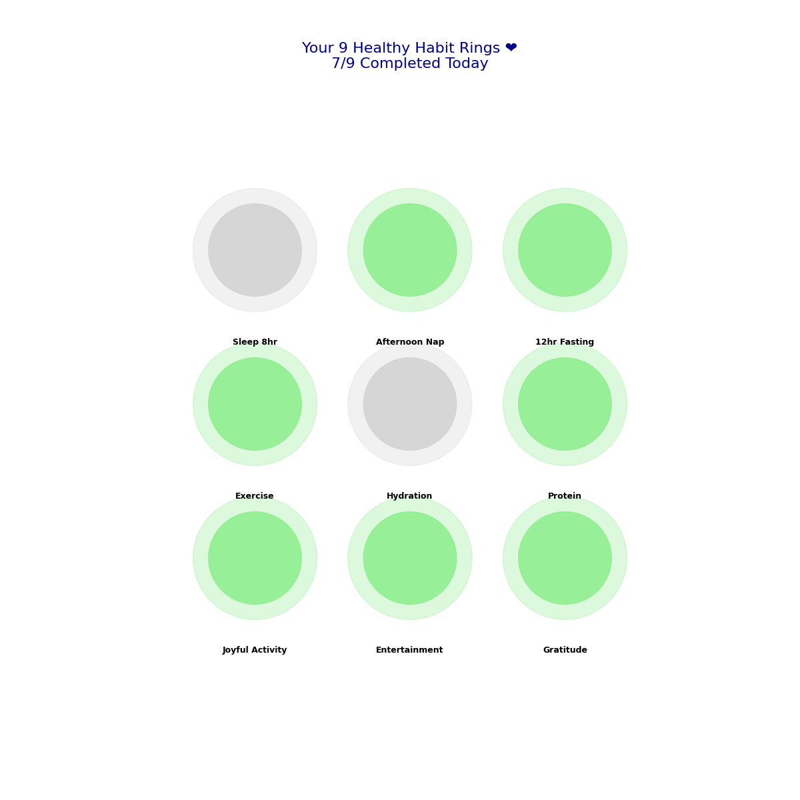

# Elderly Mood Companion

## CareFlow AI

Elderly Mood Companion is being upgraded into CareFlow AI,
an AI-powered elderly-care workflow assistant.

### What CareFlow AI adds

- NVIDIA Nemotron LLM
- Caregiver observation analysis
- Mood identification
- Follow-up suggestions
- Caregiver actions
- Memory of previous observations
- Agent decision-making

### AI Workflow

Caregiver observation
        ↓
NVIDIA Nemotron
        ↓
Agent decision
        ↓
Memory / Analysis
        ↓
CareFlow response

### Milestone 1
- [x] NVIDIA Nemotron integration
- [x] Structured AI analysis

### Milestone 2
- [x] Memory storage
- [x] Memory retrieval
- [x] Agent decision-making
- [x] Tool execution

## ✨ Features
- Friendly mood conversation
- 9 important daily habit questions
- Beautiful wellness rings diagram
- Saves result automatically as `daily_rings.png`
- Helpful tips when answer is "No"
- Available as desktop and web app

## 🌐 Live Demo

**[Try Live Web Version →](https://elderly-mood-companion.streamlit.app/)**  
*(No installation needed - works in any browser)*

## 📸 Screenshots

**1. Program Running**  


**2. Generated Wellness Rings**  


*Example: 6 out of 9 healthy habits completed*

## 🚀 How to Run

### Desktop Version
```bash
python main.py
```

### Web Version (Recommended)
```bash
streamlit run app.py
```

**📁 Project Structure**
```bash
elderly-mood-companion/
├── main.py                    # Desktop version
├── app.py                     # Web version (Streamlit)
├── README.md                  # Project documentation
├── requirements.txt           # Required packages
├── daily_rings.png            # Example output image
├── screenshot-terminal.png    # Screenshot of program running
├── LICENSE                    # License file
└── .gitignore                 # Files to ignore 
```

## 📄 License
This project is licensed under the MIT License - see the LICENSE file.

## 📊 Results
Users get clear visual feedback through progress rings — green rings show completed healthy habits, encouraging consistent daily routines.

Made with love for seniors 💕