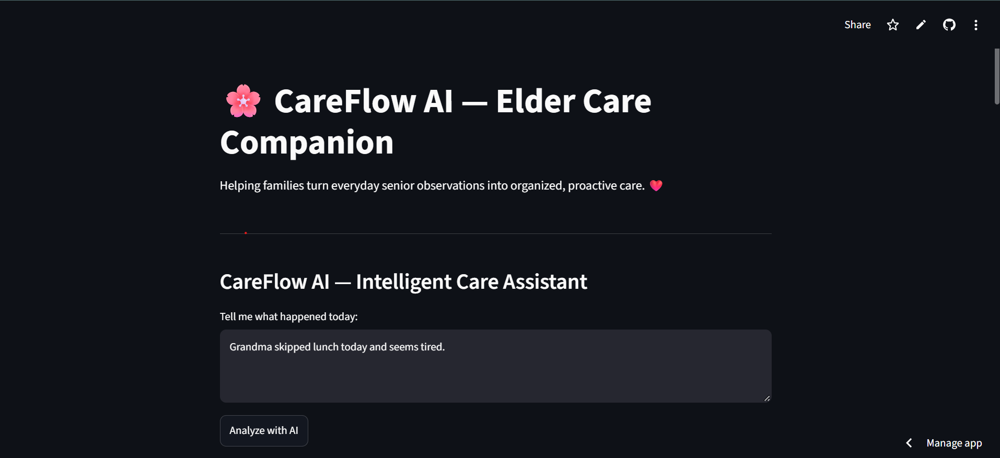
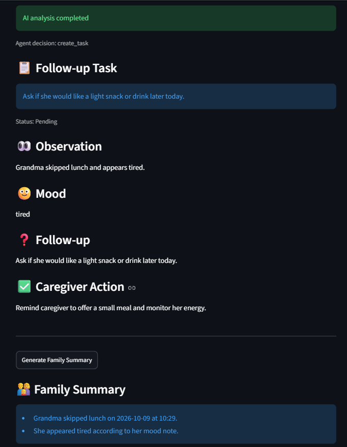
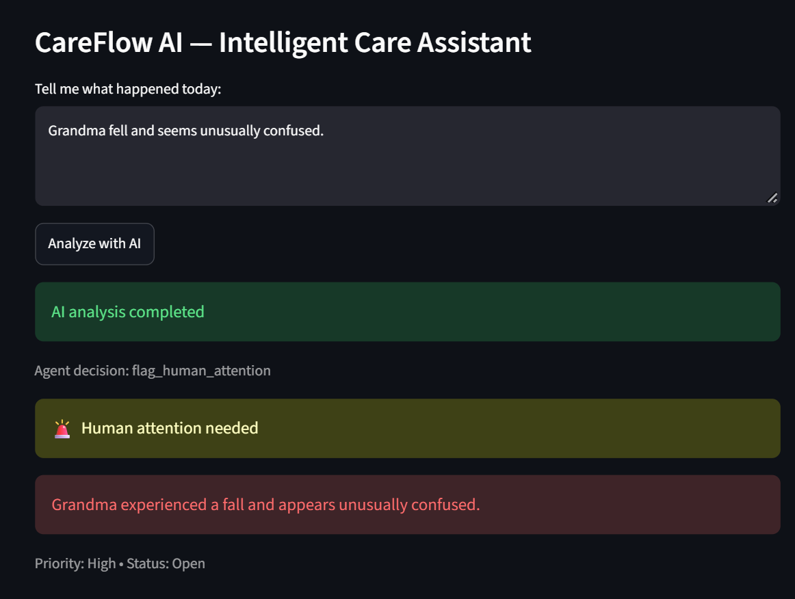
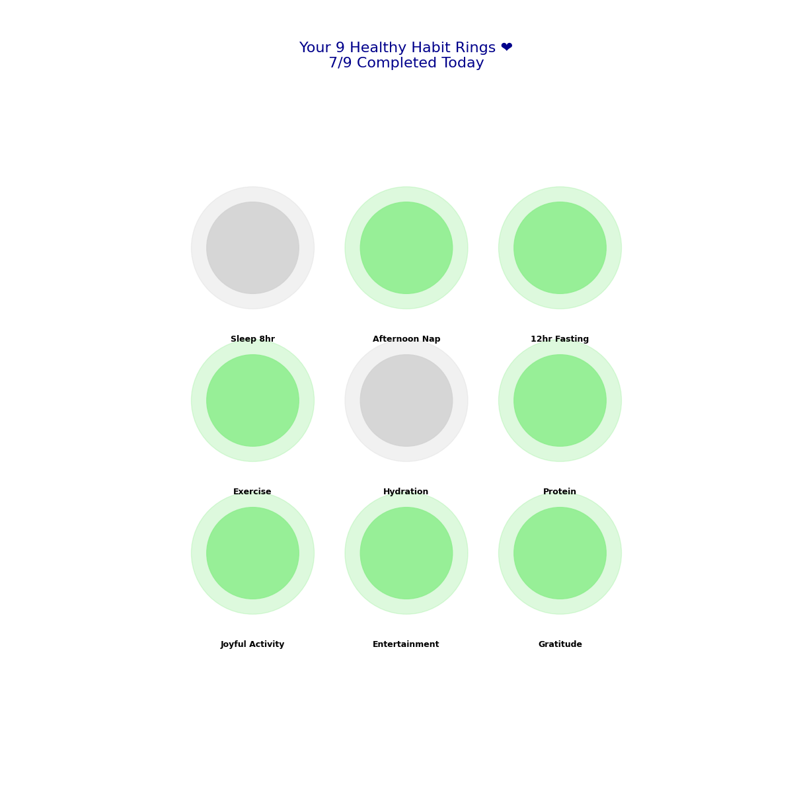

# CareFlow AI — Elder Care Companion 🌸

**AI-powered coordination for safer, more personalized senior care.**

CareFlow AI combines a friendly senior wellness experience with an AI-powered caregiver workflow. It turns everyday care observations into structured information, follow-up tasks, care history, family summaries, and human-attention alerts.

### 💡 The Problem

Caregivers often receive scattered updates about an older adult's mood, meals, sleep, daily habits, and wellbeing. Keeping track of these observations and remembering when to follow up can be difficult.

### 💚 Our Solution

CareFlow AI brings together two experiences:

- **Caregiver coordination:** AI-assisted observation analysis, follow-up tasks, care history, family summaries, and human-attention alerts.
- **Senior wellness:** mood check-ins and a nine-question daily wellness questionnaire with visual progress rings.

### ✨ Key Features

- **AI-powered analysis:** NVIDIA Nemotron interprets caregiver messages and returns structured observations, mood, follow-up suggestions, and caregiver actions.
- **Agent decision-making:** Selects an appropriate action based on the caregiver's message.
- **Care timeline:** Saves observations and mood information for later reference.
- **Follow-up tasks:** Creates pending tasks for caregivers.
- **Human-attention alerts:** Flags potentially serious situations for human follow-up.
- **Family Summary:** Summarizes recent observations in simple language.
- **Tavily web search:** Retrieves external information when the agent chooses the search tool.
- **Flexible mood check-in:** Responds supportively to a range of feelings.
- **Daily wellness rings:** Visualizes answers to nine Yes/No questions about daily habits.
- **Helpful habit tips:** Offers suggestions when a wellness question is answered “No.”

### 🧠 How It Works

1. A caregiver enters an observation or asks a question.
2. The agent chooses an action, such as saving an observation, retrieving care history, creating a task, searching the web, or flagging human attention.
3. Python executes the selected tool.
4. NVIDIA Nemotron structures the observation, mood, follow-up, and caregiver action.
5. CareFlow AI updates the relevant records and can generate a family summary.

### 🏗️ Architecture

```text
Caregiver Coordination
         │
         ▼
      CareFlow AI
         │
         ▼
 NVIDIA Nemotron 3 Super
   via Nebius Token Factory
         │
         ▼
    Agent Decision
    ├── Care Timeline / Memory
    ├── Follow-Up Tasks
    ├── Human-Attention Alerts
    ├── Tavily Web Search
    └── Family Summary


Senior Wellness Interface
         │
         ├── Mood Check-In
         │
         └── Nine-Question Wellness Check
                      │
                      ▼
             Python Wellness Scoring
                      │
                      ▼
                Wellness Rings
```
   
### 🛠️ Technology Stack

- Python — application logic and tools
- Streamlit — web interface
- Streamlit Community Cloud — deployment
- NVIDIA Nemotron 3 Super — AI analysis and agent decisions
- Nebius Token Factory — model inference API
- Tavily — external web search
- Matplotlib — wellness ring visualizations
- JSON files — prototype storage for care timeline, follow-up tasks, and human-attention alerts

### 🌐 Live Demo

[🌸 Try CareFlow AI — Elder Care Companion](https://elderly-mood-companion.streamlit.app/)

### 🚀 Run Locally

**1. Clone this repository:**
```
git clone https://github.com/DivyaMeghana09/elderly-mood-companion.git
cd elderly-mood-companion
```
**2. Install dependencies:**
```
pip install -r requirements.txt
```
**3. Configure API keys**

Create a local .env file containing the API keys required by the application. Never commit API keys or .env to GitHub.

**4. Start the application:**
```
streamlit run app.py
```
### 🔐 Safety and Privacy

CareFlow AI is designed to support caregiver coordination, not replace professional care. It does not diagnose medical conditions or prescribe treatment. Potentially serious situations should receive appropriate human and professional attention.

Do not enter unnecessary sensitive personal or medical information into a demo. The current prototype uses local JSON-based storage for care records.

### 📸 Screenshots

### 1. CareFlow AI — Main Interface

The caregiver enters an everyday observation, and CareFlow AI analyzes it using NVIDIA Nemotron.



### 2. AI Care Workflow

CareFlow AI converts an observation into a follow-up task, identifies mood, suggests caregiver action, and generates a family summary.



### 3. Human-Attention Safety Alert

When a potentially serious situation is reported, CareFlow AI flags it for human attention with a priority and status.



### 4. Daily Wellness Rings**

Nine Yes/No questions generate visual rings that summarize self-reported daily habits and wellbeing.
 


*Example: 6 out of 9 healthy habits completed*

### 🏆 Hackathon

Built for the Nebius × NVIDIA Global AI Hackathon, using NVIDIA Nemotron through Nebius Token Factory.

### 📄 License

This project is licensed under the MIT License. See the [LICENSE](LICENSE) file for details.

Made with care for seniors and the people who support them. 💕


